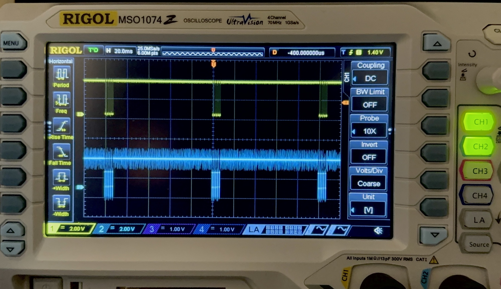

# IR LED Assembly

An IR beacon may be used to communicate information or for localization and navigation. The IR beacon included in the MSE 2202 Lab Kit consists of an infrared emitter (940 nm IR LED), an ESP32-C3 microcontroller, and a lithium polymer battery.

The ESP32-C3 in the MSE 2202 Lab Kit is can be programmed to generate a 38 kHz carrier frequency and broadcast a single character U (0x55 or 0b01010101) every 100 ms. The source code and other information related the beacon implementation is available in a separate repository on GitHub [https://github.com/MSE2202/C3-Beacon](https://github.com/MSE2202/C3-Beacon).

## Instructions

The complete process of preparing the IR LED for the beacon is demonstrated in the following video.

1. **Begin by putting on a pair of safety glasses.**

2. Start with a 2-wire female–female connector and cut it in half.

3. Strip 2 mm from the end of the 2-wire female connector and tin the ends.

4. Cut the clear heat shrink tubing in half.

5. Trim the leads on the 200 Ω resistor to a length of about 2 mm and tin the ends.

6. Trim the positive lead of the LED (longer leg) 5–6 mm shorter than the length of the heat shrink tubing. Trim the negative LED lead (shorter leg, flat side) to accommodate the resistor. The combined length of the negative lead and resistor (when solder to negative lead) should be the same as the positive lead. Tin the LED leads.

7. Solder the resistor to the negative lead of the LED.

8. Slide the heat shrink tubing over the connector wires. The wires will need to be separated sufficiently that the tubing can slide far enough away from the heat of the solder area to avoid premature shrinking.

9. Solder the LED to the terminal connector wires. Use the same colour for the positive lead as was used for the battery.

10. Slide the pieces of heat shrink tubing to fully cover the solder joints. Carefully apply heat (ideally with a heat gun, but a lighter could also be used—with caution!) to shrink the tubing around the wires.

11. **Be sure to wash your hands after handling solder.**

## Testing

The IR LED can be tested using the [IR detector](IR-detector-assembly.md) and C3 Beacon code that is hosted in a separate repository on GitHub. It may be found at [https://github.com/MSE2202/C3-Beacon](https://github.com/MSE2202/C3-Beacon). You can download (or clone) the entire repository or only the sketch in the C3-Beacon folder.

With the TSOP output connected to GPIO21, a serial monitor configured to 9600 baud can be used to display any received data (characters). The `SELF_TEST` option must be enabled.

Alternatively, the signal from GPIO6 can be connected to an oscilloscope for observation, as shown in the figure below. The output from the TSOP is shown in yellow (CH1) and the signal from the beacon is shown in blue (CH2).

## Resources

- [IR LED Data Sheet](https://www.we-online.com/components/products/datasheet/15400594A3590.pdf)
