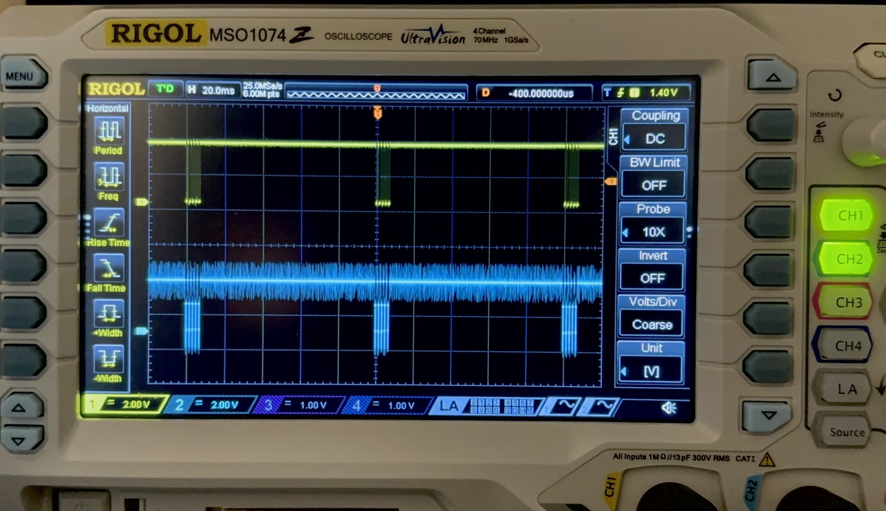

# IR Beacon Assembly

An IR beacon may be used to communicate information or for localization and navigation. The IR beacon included in the MSE 2202 Lab Kit consists of an infrared emitter (940 nm IR LED), an ESP-01S microcontroller, and a 3.7 V 200 mAh lithium polymer battery.

The ESP-01 in the MSE 2202 Lab Kit is preprogrammed to generate a 38 kHz carrier frequency and broadcast a single character U (0x55 or 0b01010101) every 100 ms. The source code and other information related the beacon implementation is available in a separate repository on GitHub [https://github.com/MSE2202/ESP01-Beacon](https://github.com/MSE2202/ESP01-Beacon).

## Instructions

The complete process of assembling the ESP-01S based IR beacon is demonstrated in the following video.

1. **Begin by putting on a pair of safety glasses.**

2. The 3.7 V lithium polymer battery can be plugged in the USB charger to ensure that it is adequately charged. Note that the battery uses a XN2.54-2P connector.

3. Start with a 2-wire female–female connector and cut it in half. One half will be used to connect the battery to the ESP-01 and the other to connect the LED.

4. The positive battery wire will include an IN4148 diode that will protect the ESP-01S in case the power leads are connected backwards. Trim the diode leads to a length of about 2–3 mm and tin the ends.

5. Trim one of the wires to accommodate the diode. The positive wire (with diode) should be the same length as the negative wire. Strip 2–3 mm from the ends of both wires and tin the ends.

6. Solder the diode to the postive wire.

7. Tin the ends of the battery connector wires. 

8. Cut two lengths from the clear heat shrink tubing. One should be 5–7 mm long and the other 13–15 mm long. Slide the longer length on tubing over the red wire and the shorter length over the black wire.

9. Solder the battery connector wires to the terminal connector wires. The red battery connector wire should be soldered to the diode.

10. Slide the pieces of heat shrink tubing to fully cover the solder joints. Carefully apply heat (ideally with a heat gun, but a lighter could also be used—with caution!) to shrink the tubing around the wires.

11. Strip 2 mm from the end of the other half of the 2-wire female connector and tin the ends.

12. Cut the remaining clear heat shrink tubing in half.

13. Trim the leads on the 180 Ω resistor to a length of about 2 mm and tin the ends.

14. Trim the positive lead of the LED (longer leg) 5–6 mm shorter than the length of the heat shrink tubing. Trim the negative LED lead (shorter leg, flat side) to accommodate the resistor. The combined length of the negative lead and resistor (when solder to negative lead) should be the same as the positive lead. Tin the LED leads.

15. Solder the resistor to the negative lead of the LED.

16. Slide the heat shrink tubing over the connector wires. The wires will need to be separated sufficiently that the tubing can slide far enough away from the heat of the solder area to avoid premature shrinking.

17. Solder the LED to the terminal connector wires. Use the same colour for the positive lead as was used for the battery.

18. Slide the pieces of heat shrink tubing to fully cover the solder joints. Carefully apply heat to shrink the tubing around the wires.

19. Connect the battery terminal to the ESP-01S. Positive to 3V3 and negative to GND. Connect the positive lead of the LED to GPIO0 and the negative LED lead to GPIO2.

20. Connect the lithium polymer battery to the battery connector. The blue LED onboard the ESP-01S should start blinking. The IR LED cannot be observed directly.

21. **Be sure to wash your hands after handling solder.**

## Testing

The IR beacon can be tested using the [IR detector](IR-detector-assembly.md) and the test code that is hosted in a separate repository on GitHub. It may be found at [https://github.com/MSE2202/BeaconTest](https://github.com/MSE2202/BeaconTest). You can download (or clone) the entire repository or only the sketch in the BeaconTest folder.

With the TSOP output connected to GPIO09, a serial monitor configured to 9600 baud can be used to display any received data (characters).

Alternatively, the signal from GPIO2 can be connected to an oscilloscope for observation, as shown in the figure below. The output from the TSOP is shown in yellow (CH1) and the signal from the beacon is shown in blue (CH2).

## Resources

- [IR LED Data Sheet](https://www.we-online.com/components/products/datasheet/15400594A3590.pdf)
- [Using the ESP-01S](https://content.instructables.com/pdfs/E6N/VI8Y/ICNNIGCW/How-to-use-the-ESP8266-01-pins.pdf)