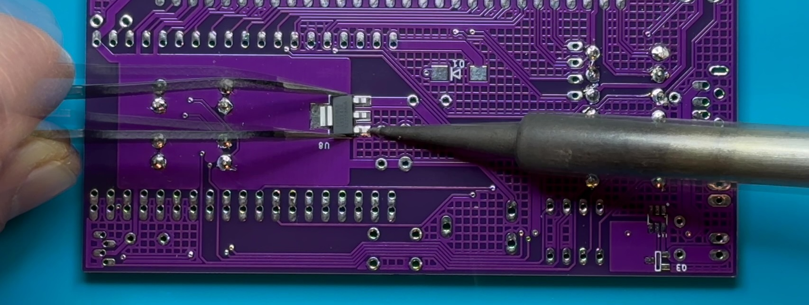

# MSE-Duino Assembly

1. Check that the small chisel soldering tip is in the soldering pen attached to the Weller soldering station. If the fine tip is installed, unscrew the   iron barrel and change the tip to the chisel-shaped one.
   
     

2. Turn on the Weller soldering station. Set the temperature dial to about 600º.
   
     

3. Start with the top (component) side of the MSE-Duino PCB. Most of the components will be placed on the top side of the board with a silkscreened white labels MSE_Duino R5.1, as shown. The through-hole components placed on the top side will be soldered to the bottom of the board.

4. Place the thirteen 4.7 kΩ resistors into their marked locations (R2--R14). Note that, the orientation of the resistor does not matter; however, it is good practice to have them all face the same way.

5. Bend the leads of the resistors outwards so that they do not fall out of place while being soldered. This may be done by reaching underneath before flipping the board over or by holding the resistors in place with one hand while flipping the board over with the other and then bending the leads outwards. In either case, the resistors should be pressed flush to the board while bending the leads. The leads should only be bent over enough to keep the resistor in place (30–50º).

6. Solder the resistor leads to the pads on the board one at a time. After soldering the first pad, check the resistor from the component side to ensure that it has not popped up.

7. Check that the solder joints are well formed. Ensure that there is sufficient, but not too much solder, at each connection. Look for cold solder joints (ball of solder above pad). If any problems are visible, use the soldering iron to retouch the joints, adding more solder if necessary.

8. Using flush cutters, trim exposed leads as close to the board as possible without cutting the joint itself. Repeat Steps 6–8 for the remaining twelve 4.7 kΩ resistors.

9. The next component to add is a surface-mount G29 P-channel MOSFET (Q8). See Steps 10–12 for details on how to solder this components to the PCB.

10. Start by heating one pad and adding a small amount of solder.

11. Reheat solder and slide part into place. The three legs (one soldered and two unsoldered) should straddle the pads.
    

12. Solder other legs to the board.

13. Turn the MSE-Duino over to work on the solder side.

14. Using the same technique used for the surface-mount MOSFET, solder the surface-mount voltage regulator (U8) into place.

15. Solder the two A1233 Hall sensors (U1 and U2). Be careful to align the indentation on the upper-left corner of chip with the white circle on the PCB. This ensures that the chip is oriented properly. Use the same technique used for the other surface-mount components, soldering a single pin first, then soldering the remaining 7 pins. If solder bridges across two or more pins, use a soldering iron in combination with a solder sucker to reflow the solder and remove the excess from between the pins.

16. Turn the MSE-Duino back to the component side. Insert the narrow-gauge male headers into the PCB. Note that the pins are shorter on one side of the header. The short side should be inserted into the holes (long end of pin up). To assist with alignment, use the acrylic pin-alignment tool that is included in your Lab Kit. Place all three headers into the board, place the alignment tool overtop and flip the board to solder. Start by soldering one pin on each header. Check each header for seating and alignment, adjusting by reworking the solder, if necessary. Once the alignment looks good, solder the remaining pins on each header. It is suggested to place the iron on the larger side of each pad and bring solder in from the other side, rotating the PCB as necessary to provide good access.

17. Solder in the two pushbuttons (marked as Rst and Prog/PB 0 on the PCB). The buttons may be installed in either orientation. There is no need to trim the pins after soldering.

18. Being careful to not bend any pins, insert the DIP switch into the marked location on the board (S1). Note that, the numbers should be towards the inside of the PCB, with the ON direction towards the upper edge of the PCB.  Solder two diagonally-opposite corners first. Check to make sure that the socket is seated properly. If necessary, reheat the solder at each corner while pushing the socket closer to the board. Once the socket is firmly seated, solder the remaining pins. There is no need to trim the pins after soldering.

19. Place the bipolar LED in the LED 2 location. Since this LED is bipolar, it will work either way; however, if you want to chose the colour (red or green) it must be installed in a particular orientation. For red, the short leg should be towards the left (flat side of silkscreen); for green, the short leg should be on the right (round side of silkscreen). To check before soldering, you can energize the LED using the diode testing function of a digital multimeter. Once placed, solder the LED to the board.

20. Place seven 0.1 µF ceramic capacitors (C1, C3, C4, C5, C6, C7, C9) into their marked locations. Ceramic capacitors are not polarized, therefore it does not matter what orientation the capacitors are placed in (although it is good practice to face them all the same way). You may then bend the leads, and solder them in place. **Note that C8 will be soldered later.**

21. Place the 10 kΩ potentiometer in location R1. Solder the potentiometer to the board by a single pin, check and adjust alignment, then solder remaining pins.

22. Solder the 3-pin female headers at the bottom edge of the board. Note that the shorter pins should be inserted into the PCB (long end of pin up). There are 32 in total (J1–J18, J21, J35–J42, J45–J48, JP2). Start by soldering one pin of each header, checking that each is sitting flat and straight. If necessary, reheat the solder to adjust and ensure that all of the pins are perpendicular to the PCB and that all of the headers are aligned. Once everything looks good, solder the remaining pins. **Note that J50 is left empty.**

23. Solder the 4-pin female header (JP1) at the bottom edge of the board. It should align with J45.

24. Solder a 1-pin header into the bottom hole for C8. This can be used to supply 5 VDC directly from the USB connector without any voltage drop across Q8.

25. Place the 2N7000 N-channel MOSFETs (Q1, Q2). Ensure that they are seated properly and solder one pin of each. If necessary, adjust the alignment, then solder the remaining pins.

26. Place the three 10 µF electrolytic capacitors (C1, C12, C14). Note that, unlike ceramic capacitors, electrolytic capacitors have a polarity. The side with the negative lead is indicated by a white band (containing negative signs) on the capacitor barrel. The pad for the positive lead is marked with a plus sign on the board. Once placed, solder the capacitors to the board.

27. Place the addressable RGB LED (LED1). Ensure that the flat side (with longer leads) is aligned with the silkscreen (towards the middle of the board). Some ``wiggling'' may be necessary to get all four leads to align with the holes. Solder in place and trim the leads.

28. Turn the MSE-Dunio over to the solder side. Place the USB-A connector. Flip the board and solder one of the four small pins. Check alignment and then solder the remaining three small pins. The two large pins serve to reinforce the connection to the board. Flood the corresponding holes with solder for form a secure connection.

29. Turn the MSE-Duino back to the component side. Bend one of the leads of the last 0.1 µF ceramic capacitor to be perpendicular to the body. Place the unbend lead into the upper hole for C8. Rotate the capacitor until the bent lead aligns with the bottom pin of the USB connector. Trim the lead to this length and solder to the bottom USB pin. Solder and trim the other lead.

30. Once the boards have been soldered, it is important to test for short circuits and other potential issues \textbf{before} inserting the ESP32. Using a multimeter set to continuity (beep) mode, the following tests should be performed. If a beep is heard, the source of the short circuit must be identified and corrected.
    1. Ground (centre hole or pins along bottom edge of board) to 3.3 VDC pins (middle pins of J3–J18, J46).
    2. Ground (center hole or pins along bottom edge of board) to 5.0 VDC pins (middle pins of J21, J35–J42, J45, J47, J48).
    3. 3.3 VDC (middle pins of J3–J18, J46) to 5 VDC pins (middle pins of J21, J35–J42, J45, J47, J48).
    4. If the board passes the short circuit tests, connect the MSE-Duino board to USB power using the USB-A to USB-A cable. Using a multimeter in DC voltage mode, the following tests should be performed. If the voltages are different than expected, then there is a problem with the board that must be identified before proceeding.
    5. Check that LED2 comes on.
    6. Check that 3.3 VDC is at the 3.3 VDC pins (middle pins of J3–J18, J46).
    7. Check that 5.0 VDC is at 5.0 VDC pins (middle pins of J21, J35–J42, J45, J47, J48).
    8. If the board passes the voltage checks, remove USB power.
    9. **Before proceeding, have a TA confirm that your board passes these tests.**

31. Place the bottom half of ESP32 ZIF connector on the board.

32. Carefully insert the ESP32 module between the pins and push down to seat against bottom of headers.

33. Put two strips of masking tape along the right edge of the top half of the ESP32 ZIF connector. Place ZIF connector on top of ESP32 module and secure in place with four 4-40 screws and nuts.

34. Your fully-assembled MSEduino board with ESP32 installed should look like this:
