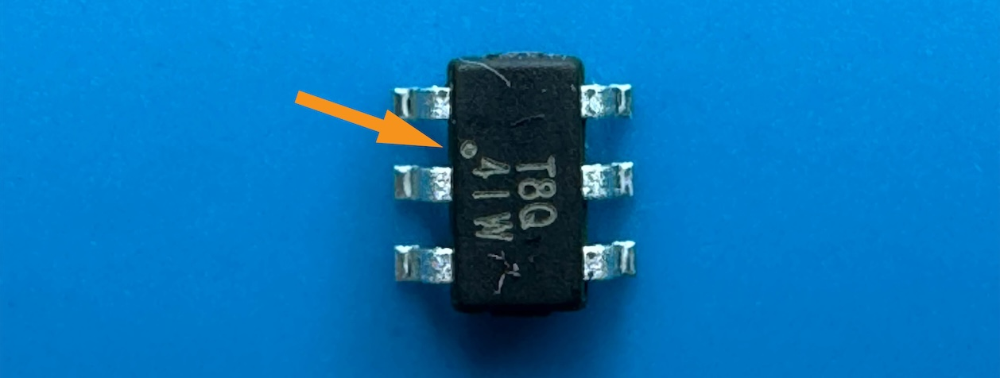
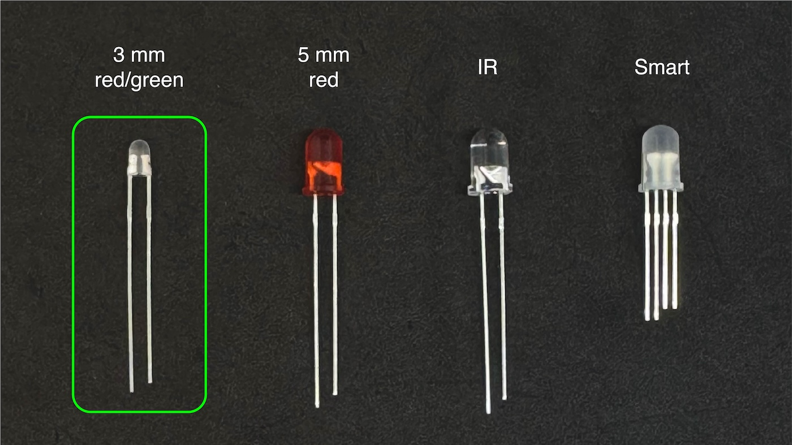
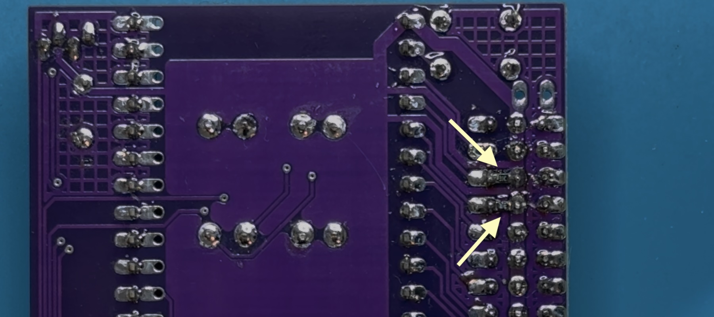
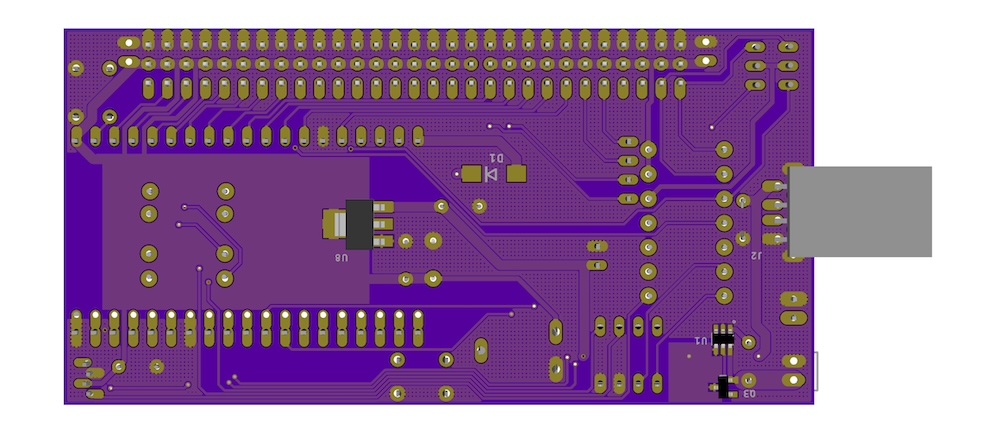

# MSEduino Assembly Instructions

## Preparation

If you have not done so already, please review [Soldering is Easy](https://mightyohm.com/files/soldercomic/FullSolderComic_EN.pdf). It contains helpful information and tips about best practice for soldering. It is highly recommended that you review it, *even if you have experience with soldering*.

## References

- [Resistor Colour Codes](https://www.digikey.com/web%20export/mkt/general/mkt/resistor-color-chart.jpg)
- [Capacitor Codes](https://i2.wp.com/www.bragitoff.com/wp-content/uploads/2015/09/CapacitorsCheatSheet.png)
- [MSEduino R6.1 Pinouts](MSEduino/MSEduino_R6.1_Pinouts.pdf)
- [MSEduino R6.1 Schematic](MSEduino/MSEduino_R6.1_Schematic.pdf)
- [MSEduino R6.1 PCB Top](MSEduino/MSEduino_R6.1_Top.pdf)
- [MSEduino R6.1 PCB Bottom](MSEduino/MSEduino_R6.1_Bottom.pdf)

## Instructions

The entire MSEduino build is demonstrated the video below. It is recommended that, in addition to carefully reading the instructions here, you watch or follow along with the video for suggestions and tips **before** completing each step.

1. **Begin by putting on a pair of safety glasses.**

2. Turn on the Weller soldering station. Set the temperature dial to about 600º.

    

3. Start with the top (component) side of the MSEduino PCB. Most of the components will be placed on the top side of the board with a silkscreened white labels MSE_Duino R6.1, as shown. The through-hole components placed on the top side will be soldered to the bottom of the board.

    

4. Place eleven 4.7 kΩ resistors into their marked locations (R2, R3, R5, R6, R8–R14). Note that, the orientation of the resistor does not matter; however, it is good practice to have them all face the same way.

    
    

5. Bend the leads of the resistors outwards so that they do not fall out of place while being soldered. This may be done by reaching underneath before flipping the board over or by holding the resistors in place with one hand while flipping the board over with the other and then bending the leads outwards. In either case, the resistors should be pressed flush to the board while bending the leads. The leads should only be bent over enough to keep the resistor in place (30–50º).

    

6. Solder one of resistor leads to the pad on the PCB. Once soldered, check the resistor from the component side to ensure that it has not popped up. If it has, reheat the solder and, begin careful to not burn your fingers, press the resistor to the PCB. Solder the other lead.

    

7. Check that the solder joints are well formed. Ensure that there is sufficient, but not too much solder, at each connection. Look for cold solder joints (a ball of solder above pad). If any problems are visible, use the soldering iron to retouch the joints, adding more solder if necessary.

8. Using flush cutters, trim exposed leads as close to the board as possible without cutting the joint itself. Repeat Steps 6–8 for the remaining fourteen 4.7 kΩ resistors.

    

9. The next component to add is a SP1117 surface-mount voltage regulator (U8). See Steps 11–14 for details on how to solder this component to the PCB.

    

10. Start by heating one pad and adding a small amount of solder.

    

11. Holding the component with a pair of tweezers or needle-nose pliers, reheat the solder and slide the part into place. The three legs (one soldered and two unsoldered) should straddle the pads. If the legs are not aligned properly aligned with the pads, reheat the pad/leg with solder and reposition.

    

12. Solder other legs to the board. Solder should flow under each leg.

    

13. Solder the ground tab to the board. Note that the ground pad will take a while to heat up to a sufficient temperature to allow solder to flow properly. The solder should flow under the tab.

    

14. Using the same technique used for the surface-mount voltage regulator, solder the MOSFET (Q3) into place. 

    

15. Solder the six-pin load switch (U1) into place. Be careful to align the dot that marks pin 1 with the dot on the PCB.

    
    

16. Turn the MSEduino over to work on the solder side.

17. Solder in the two pushbuttons (marked as Prog/PB1 and PB2/Rst on the PCB). The buttons may be installed in either orientation. There is no need to trim the pins after soldering.

    

18. Being careful to not bend any pins, insert the DIP switch into the marked location on the board (S1). You may need to gently roll the component on a flat surface or use pliers to bend the pins such that they align the holes. Note that, the numbers should be towards the inside of the PCB, with the ON direction towards the upper edge of the PCB. Solder one corner first. Check to make sure that the socket is seated properly. If necessary, reheat the solder while pushing the socket closer to the board. Once the socket is firmly seated, solder the remaining pins. There is no need to trim the pins after soldering.

    

19. Place the **3 mm** bipolar LED (**small clear package—not one of the 5 mm red LEDs or 5 mm clear IR LED**) in the LED 2 location. Since this LED is bipolar, it will work either way; however, if you want to chose the colour (red or green) it must be installed in a particular orientation. For red, the short leg should be downwards (flat side of silkscreen); for green, the short leg should be upwards (round side of silkscreen). To check before soldering, you can energize the LED using the diode testing function of a digital multimeter. Once placed, solder the LED to the board.

    
    
    
20. Place five 0.1 µF ceramic capacitors (C1, C2, C6, C8, C9) into their marked locations. Ceramic capacitors are not polarized, therefore it does not matter what orientation the capacitors are placed in (although it is good practice to face them all the same way). You may then bend the leads, and solder them in place.

    

21. Place the 2N7000 N-channel MOSFETs (Q1, Q2). Ensure that they are seated properly and solder one pin of each. If necessary, adjust the alignment, then solder the remaining pins.

    

22. Place the 10 kΩ potentiometer in location R1. Solder the potentiometer to the board by a single pin, check and adjust alignment, then solder remaining pins. There is no need to trim the pins after soldering.

    

23. Solder the three 29-pin male headers at the bottom edge of the board. Black (inner) is used for signal, yellow and red (middle) for power, and green (outer) for ground. For the black and green headers, start by using a pair of pliers to break off eleven pins (reducing from 40). Save the broken off pins. Note that the shorter pins should be inserted into the PCB (long end of pin up) and no pins should be inserted into the holes for JP2 and JP3. Start by soldering one pin of each header, checking that each is sitting flat and straight. If necessary, reheat the solder to adjust and ensure that all of the pins are perpendicular to the PCB and that all of the headers are aligned. Once everything looks good, solder the remaining pins.

    

24. Solder the 19-pin female headers (M1). Note that there are two rows that allow ESP32 modules with different widths to be used. Confirm which row should be used by lining up the ESP32 module on the PCB.

    

25. Solder the 2-pin female header to the left of R5 and R9 and 4-pin female header to the left of R11, R12 and R14.

    

26. Turn the board over to the solder side. Using a pair of tweezers, solder a 20 kΩ surface-mount resistor (603 package) between the J39 signal pin (inner) and 3.3 V pin (middle). Repeat for J34.

    

27. Turn the board over to the comoponent side. Place the 10 µF electrolytic capacitor (C14). Note that, unlike ceramic capacitors, electrolytic capacitors have a polarity. The side with the negative lead is indicated by a white band (containing negative signs) on the capacitor barrel. The pad for the positive lead is marked with a plus sign on the board. Once placed, solder the capacitors to the board and trim the leads.

    

28. Place the addressable RGB LED (LED1). Ensure that the flat side (with longer leads) is aligned with the silkscreen (towards the middle of the board). Some "wiggling" may be necessary to get all four leads to align with the holes. Don't push past the widening in each lead—the LED should sit approximately 4 mm above the PCB. Solder in place and trim the leads.

    

29. Turn the MSEdunio over to the solder side. Place the USB-A connector (J2), ensuring that it is fully seated against the PCB. Flip the board and solder one of the four small pins. Check alignment and then solder the remaining three small pins. The two large pins serve to reinforce the connection to the board. Flood the corresponding holes with solder for form a secure connection.

    
    

30. Once the board has been soldered, it is important to test for short circuits and other potential issues **before** inserting the ESP32 module. Using a multimeter set to continuity (beep) mode, the following tests should be performed. If a beep is heard, the source of the short circuit must be identified and corrected.
    1. Ground (bottom hole of JP2 or JP3, or pins along bottom edge of board) to 3.3 VDC pins (middle pins of J0–J3, J5, J18, J19, J21–J23, J25, J32–J36, J39, RST).
    2. Ground (bottom hole of JP2 or JP3, or pins along bottom edge of board) to 5.0 VDC pins (middle pins of J4, J12–J17, J21-5, J22-5, J26, J27).
    3. 3.3 VDC (middle pins of J0–J3, J5, J18, J19, J21–J23, J25, J32–J36, J39, RST) to 5 VDC pins (middle pins of J4, J12–J17, J21-5, J22-5, J26, J27).

31. If the board passes the short circuit tests, connect the MSEduino board to USB power using the USB-A to USB-A cable or a fully-charged USB battery. Using a multimeter in DC voltage mode, the following tests should be performed. If the voltages are different than expected, then there is a problem with the board that must be identified before proceeding.
    1. Check that LED2 comes on.
    2. Check that 3.3 VDC is at the 3.3 VDC pins (middle pins of J0–J3, J5, J18, J19, J21–J23, J25, J32–J36, J39, RST).
    3. Check that 5.0 VDC is at 5.0 VDC pins (middle pins of J4, J12–J17, J21-5, J22-5, J26, J27).
    4. If the board passes the voltage checks, remove USB power.
    5. **Before proceeding, have a TA confirm that your board passes these tests.**

32. Carefully align the pins of the ESP32 module with the M1 headers and then insert the ESP32 module.

    

33. Your fully-assembled MSEduino board with ESP32 installed should look like this:

    

34. **Be sure to wash your hands after handling solder.**
