# MSEduino Assembly Instructions

## Preparation

If you have not done so already, please review [Soldering is Easy](https://mightyohm.com/files/soldercomic/FullSolderComic_EN.pdf). It contains helpful information and tips about best practice for soldering. It is highly recommended that you review it, *even if you have experience with soldering*.

## References

- [Resistor Colour Codes](https://www.digikey.com/web%20export/mkt/general/mkt/resistor-color-chart.jpg)
- [Capacitor Codes](https://i2.wp.com/www.bragitoff.com/wp-content/uploads/2015/09/CapacitorsCheatSheet.png)
- [MSEduino R5.1 Pinouts](MSEduino.MSEduino_R5.1_Pinout.pdf)
- [MSEduino R5.1 Schematic](MSEduino/MSEduino_R5.1_Schematic.pdf)
- [MSEduino R5.1 PCB Top](MSEduino/MSEduino_R5.1_Top.pdf)
- [MSEduino R5.1 PCB Bottom](MSEduino/MSEduino_R5.1_Bottom.pdf)
- [MSEduino R5.1 PCB Ratsnest.pdf](MSEduino/MSEduino_R5.1_Bottom_Ratsnest.pdf)

## Instructions

1. **Begin by putting on a pair of safety glasses.**

1. Check that the small chisel soldering tip is in the soldering pen attached to the Weller soldering station. If the fine tip is installed, unscrew the   iron barrel and change the tip to the chisel-shaped one.

    

2. Turn on the Weller soldering station. Set the temperature dial to about 600º.

    

3. Start with the top (component) side of the MSEduino PCB. Most of the components will be placed on the top side of the board with a silkscreened white labels MSE_Duino R5.1, as shown. The through-hole components placed on the top side will be soldered to the bottom of the board.

    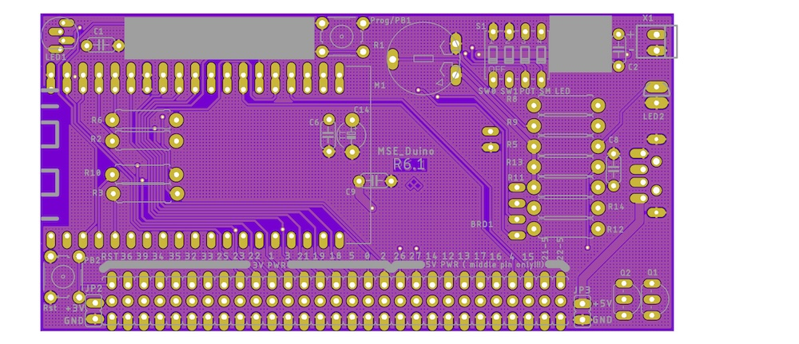

4. Place fifteen 4.7 kΩ resistors into their marked locations (R2–R14, R17, R18). The tab at the end of the acrylic FlexyPin alignment tool can be used to bend the leads to align with the holes in the PCB. Note that, the orientation of the resistor does not matter; however, it is good practice to have them all face the same way.

    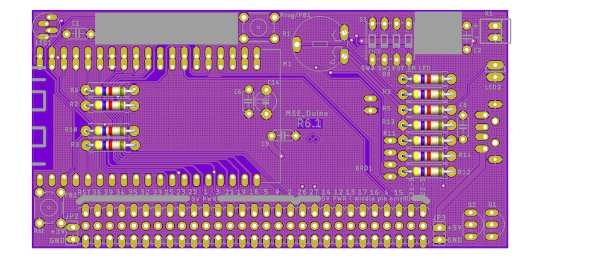

5. Bend the leads of the resistors outwards so that they do not fall out of place while being soldered. This may be done by reaching underneath before flipping the board over or by holding the resistors in place with one hand while flipping the board over with the other and then bending the leads outwards. In either case, the resistors should be pressed flush to the board while bending the leads. The leads should only be bent over enough to keep the resistor in place (30–50º).

    

6. Solder the resistor leads to the pads on the board one at a time. After soldering the first pad, check the resistor from the component side to ensure that it has not popped up.

    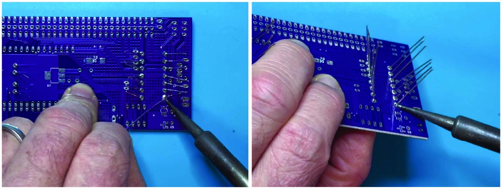

7. Check that the solder joints are well formed. Ensure that there is sufficient, but not too much solder, at each connection. Look for cold solder joints (a ball of solder above pad). If any problems are visible, use the soldering iron to retouch the joints, adding more solder if necessary.

    

8. Using flush cutters, trim exposed leads as close to the board as possible without cutting the joint itself. Repeat Steps 6–8 for the remaining twelve 4.7 kΩ resistors.

    

9. The next component to add is a SP1117 surface-mount voltage regulator (U8). See Steps 10–12 for details on how to solder this components to the PCB.

    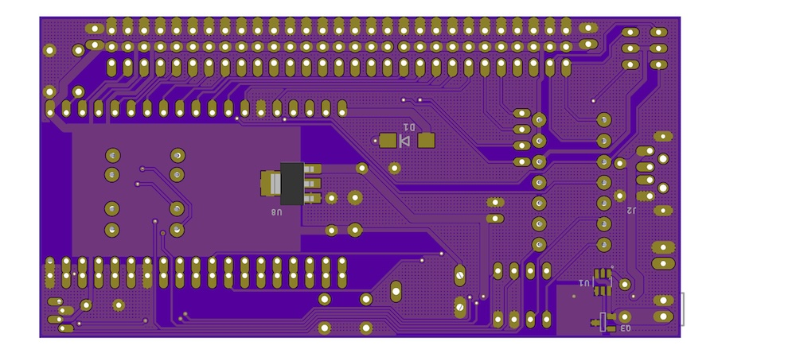

10. Start by heating one pad and adding a small amount of solder.

    

11. Holding the part with a pair of tweezers or needle-nose pliers, reheat the solder and slide the part into place. The three legs (one soldered and two unsoldered) should straddle the pads. If the legs are not aligned properly aligned with the pads, reheat the pad/leg with solder and reposition.

    

12. Solder other legs to the board. Solder should flow under each leg.

    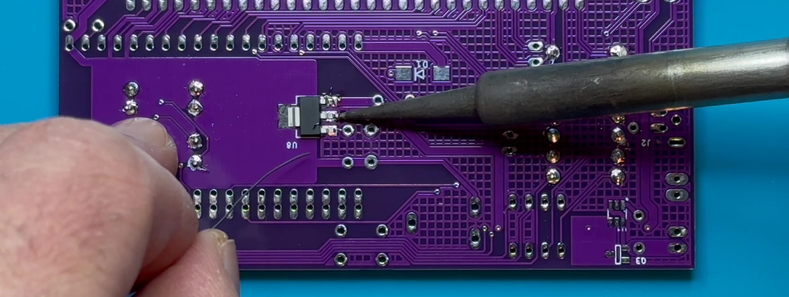

12. Solder the ground tab to the board. Note that the ground pad will take a while to heat up to a sufficient temperature to allow solder to flow properly. The solder should flow under the tab.

    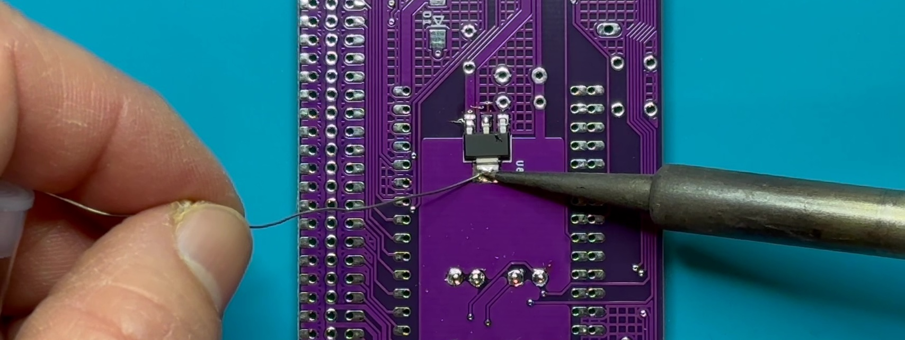

13. Using the same technique used for the surface-mount voltage regulator, solder the Schottky diode array (D1) into place. Note that the large ground pad will take even longer to reach soldering temperature.

    

13. Turn the MSEduino over to work on the solder side.

17. Solder in the two pushbuttons (marked as Prog/PB1 and PB2/Rst on the PCB). The buttons may be installed in either orientation. There is no need to trim the pins after soldering.

    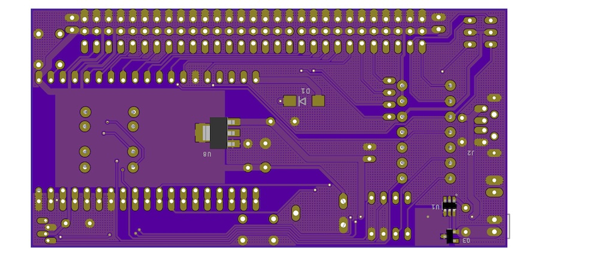

18. Being careful to not bend any pins, insert the DIP switch into the marked location on the board (S1). Note that, the numbers should be towards the inside of the PCB, with the ON direction towards the upper edge of the PCB.  Solder two diagonally-opposite corners first. Check to make sure that the socket is seated properly. If necessary, reheat the solder at each corner while pushing the socket closer to the board. Once the socket is firmly seated, solder the remaining pins. There is no need to trim the pins after soldering.

    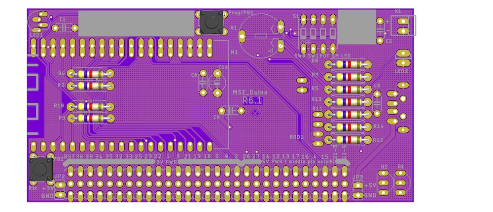

19. Place the bipolar LED in the LED 2 location. Since this LED is bipolar, it will work either way; however, if you want to chose the colour (red or green) it must be installed in a particular orientation. For red, the short leg should be downwards (flat side of silkscreen); for green, the short leg should be upwards (round side of silkscreen). To check before soldering, you can energize the LED using the diode testing function of a digital multimeter. Once placed, solder the LED to the board.

    

20. Place six 0.1 µF ceramic capacitors (C1, C4, C5, C6, C7, C9) into their marked locations. Ceramic capacitors are not polarized, therefore it does not matter what orientation the capacitors are placed in (although it is good practice to face them all the same way). You may then bend the leads, and solder them in place.

    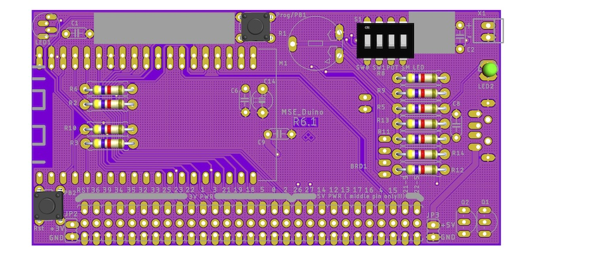

25. Place the 2N7000 N-channel MOSFETs (Q1, Q2). Ensure that they are seated properly and solder one pin of each. If necessary, adjust the alignment, then solder the remaining pins.

    

21. Place the 10 kΩ potentiometer in location R1. Solder the potentiometer to the board by a single pin, check and adjust alignment, then solder remaining pins.

    

22. Solder the three 37-pin male headers at the bottom edge of the board. Start by using a pair of pliers to break off three pins (reducing from 40). Note that the shorter pins should be inserted into the PCB (long end of pin up). Start by soldering one pin of each header, checking that each is sitting flat and straight. If necessary, reheat the solder to adjust and ensure that all of the pins are perpendicular to the PCB and that all of the headers are aligned. Once everything looks good, solder the remaining pins.

    

23. Solder the 2-pin male header (X1) at the top edge of the board.

    

24. Solder the 2-pin female header below R11.

    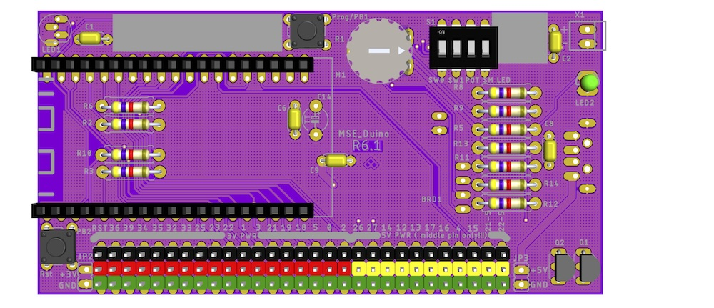

25. Solder the 4-pin female header to the left of R8.

    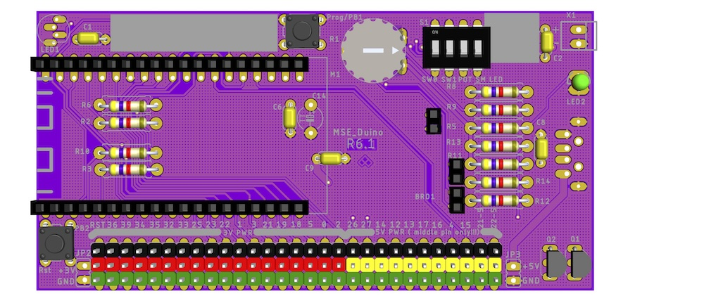

26. Place the two 10 µF electrolytic capacitors (C12, C14). Note that, unlike ceramic capacitors, electrolytic capacitors have a polarity. The side with the negative lead is indicated by a white band (containing negative signs) on the capacitor barrel. The pad for the positive lead is marked with a plus sign on the board. Once placed, solder the capacitors to the board.

    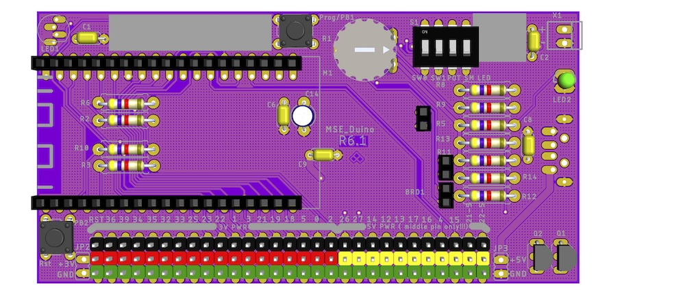

27. Place the addressable RGB LED (LED1). Ensure that the flat side (with longer leads) is aligned with the silkscreen (towards the middle of the board). Some ``wiggling'' may be necessary to get all four leads to align with the holes. Don't push past the widening in each lead—the LED should sit approximately 4 mm above the PCB. Solder in place and trim the leads.

    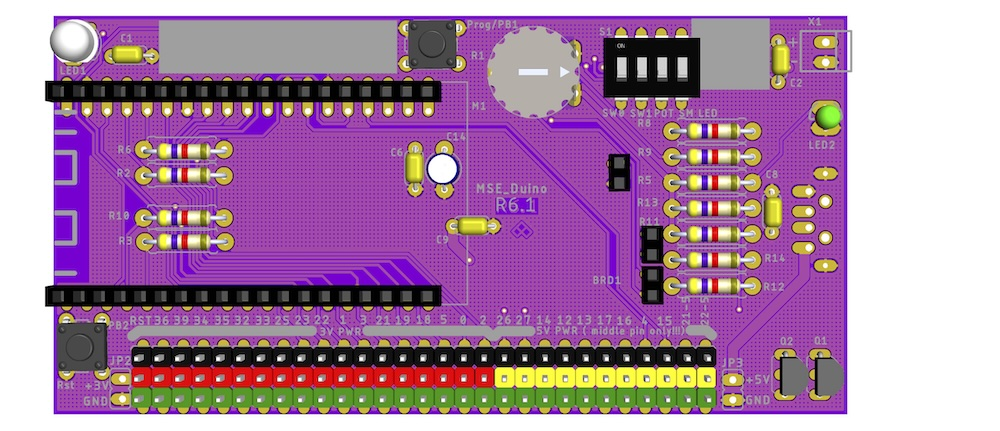

28. Turn the MSEdunio over to the solder side. Place the USB-A connector. Flip the board and solder one of the four small pins. Check alignment and then solder the remaining three small pins. The two large pins serve to reinforce the connection to the board. Flood the corresponding holes with solder for form a secure connection.

    

29. Turn the MSEduino back to the solder side. Carefully insert 40 FlexyPins into the board with the long end in the oval hole and the short end in the smaller one. Use the acrylic FlexyPin alignment tool to align all of the pins. Flip the board and solder all of the short ends, being careful to not create solder "bridges" between adjacent pads. If a solder bridge does form, use a solder sucker to remove. Counterinuitively, it may be helpful to add more solder to the bridged pins before reheating and sucking away the excess solder.

    

30. Once the board has been soldered, it is important to test for short circuits and other potential issues **before** inserting the ESP32. Using a multimeter set to continuity (beep) mode, the following tests should be performed. If a beep is heard, the source of the short circuit must be identified and corrected.
    1. Ground (centre hole or pins along bottom edge of board) to 3.3 VDC pins (middle pins of J0, J3–J18, J46–J48).
    2. Ground (center hole or pins along bottom edge of board) to 5.0 VDC pins (middle pins of J0–J2, J21, J35–J45, J47-5, J48-5).
    3. 3.3 VDC (middle pins of J0, J3–J18, J46–J48) to 5 VDC pins (middle pins of J0–J2, J21, J35–J45, J47-5, J48-5).
    4. If the board passes the short circuit tests, connect the MSEduino board to USB power using the USB-A to USB-A cable or a fully-charged USB battery. Using a multimeter in DC voltage mode, the following tests should be performed. If the voltages are different than expected, then there is a problem with the board that must be identified before proceeding.
        1. Check that LED2 comes on.
        2. Check that 3.3 VDC is at the 3.3 VDC pins (middle pins of J0, J3–J18, J46–J48).
        3. Check that 5.0 VDC is at 5.0 VDC pins (middle pins of J0–J2, J21, J35–J45, J47-5, J48-5).
    5. If the board passes the voltage checks, remove USB power.
    6. **Before proceeding, have a TA confirm that your board passes these tests.**

31. With the chamfered corners on the leading edge, insert the acrylic FlexyPin spreader into the FlexyPins. 

    

32. Carefully insert the ESP32 module between the pins. Confirm that all of the FlexyPins are properly aligned with the corresponding notch in the ESP32 module. Once everything is properly aligned, remove the pin spreader. 

    

33. Your fully-assembled MSEduino board with ESP32 installed should look like this:

    

35. **Be sure to wash your hands after handling solder.**