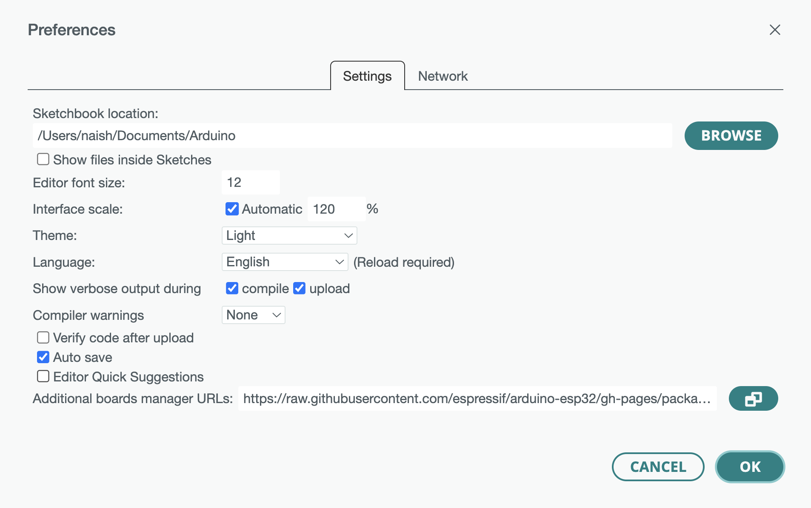
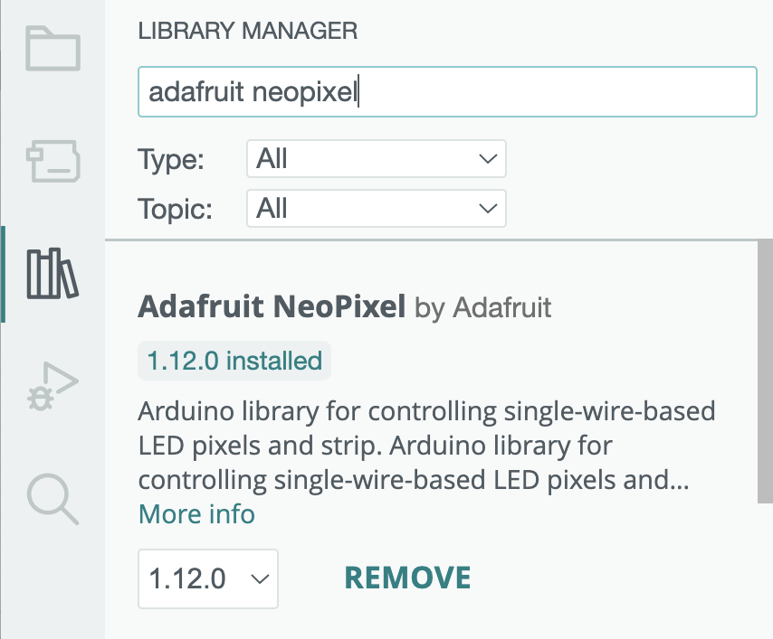
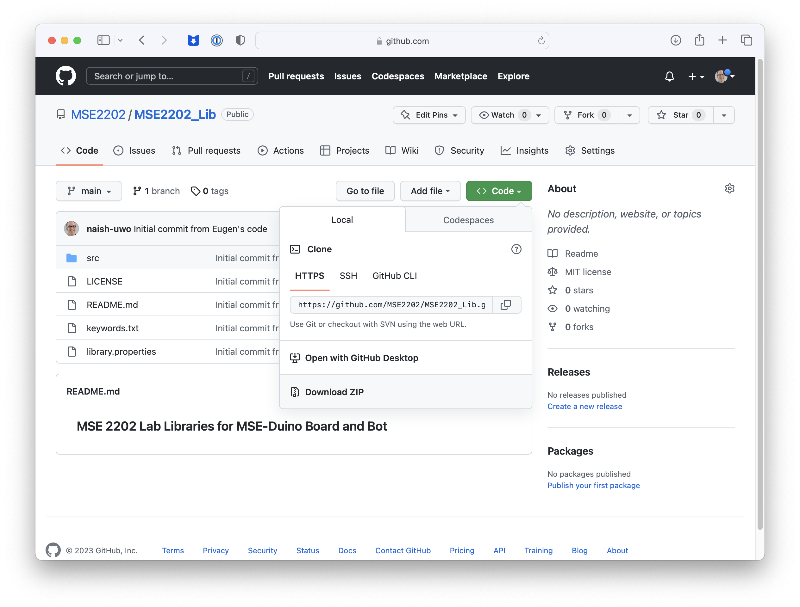
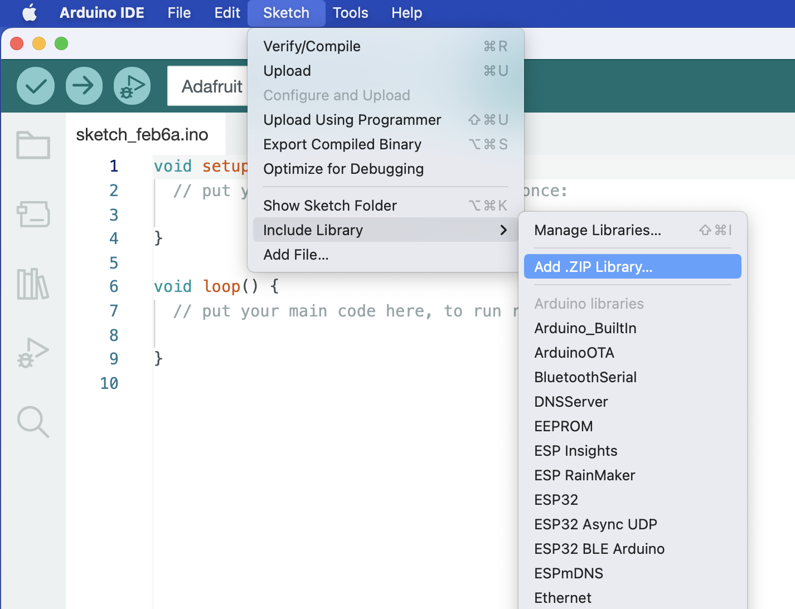
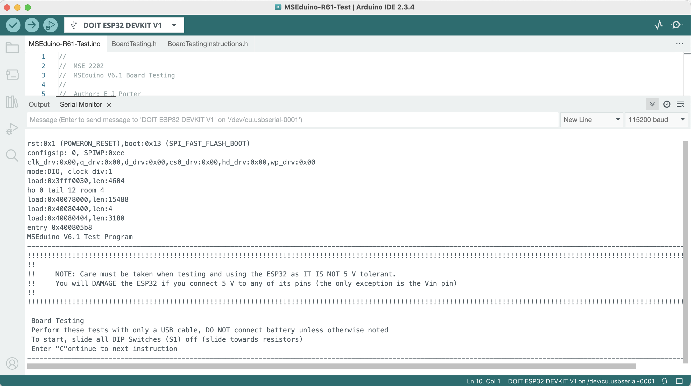

# MSEduino Testing

In order to test the functionality of the MSEduino, test code must be loaded onto the device.

Programs for the [Arduino](https://www.arduino.cc) are called sketches. These are created within an Integrated Development Environment (IDE) for the Arduino. The IDE allows sketches to be written and edited. The language and constructs are similar to C++. It provides functionality to convert (or compile) the human-readable code into instructions that the Arduino hardware understands (machine language). The IDE also facilitates the process of uploading compiled machine code onto the Arduino board. The IDE is available for Windows, Mac OS X and Linux based systems.

To start, Visit the official Arduino website and click on the [Getting Started](https://arduino.cc/en/Guide/HomePage) header. Follow the step-by-step instructions to install the Arduino IDE for the operating system on your laptop or home computer. Open the [Arduino IDE](https://www.arduino.cc/en/software) and configure it for the ESP32. You will first need to add the ESP32 as an additional board. Open Preferences and enter the following in the Additional boards manager URLs textbox:
https://raw.githubusercontent.com/espressif/arduino-esp32/gh-pages/package_esp32_index.json, as shown below. In order to help identify the cause of hangups and errors during the build and upload processes, it is recommended that verbose output be enabled.

Once added, the Arduino IDE will download the board libraries. Use a USB-A extension cable to connect your MSEduino to your computer. Use the **Tools→Board→esp32** menu to select the **Adafruit Feather ESP32-S3 No PRAM board**. The Port should be set as **COMx** on Windows or **dev.cu.usbmodel14101** (or similar) on Mac. Your configuration should be as follows:

| Parameter                            | Setting                          |
|--------------------------------------|----------------------------------|
| USB CDC On Boot                      | Enabled                          |
| CPU Frequency                        | 240MHz (WiFi)                    |
| Core Debug Level                     | Verbose                          |
| USB DFU On Bot                       | Disabled                         |
| Erase All Flash Before Sketch Upload | Disabled                         |
| Events Run On                        | Disabled                         |
| Flash Mode                           | QIO 80MHz                        |
| Flash Size                           | 8MB (64Mb)                       |
| Arduino Runs On                      | Core 1                           |
| USB Firmware MSC on Boot             | Disabled                         |
| Partition Scheme                     | TinyUF2 8MB (2MB APP/3.7MB FFAT) |
| Upload Mode                          | USB-OTG CDC (Tiny USB)           |
| Upload Speed                         | 921600                           |
| USB Mode                             | USB-OTG (TinyUSB)                |
| Zigbee Mode                          | Disabled                         |

#### VSCode and PlatformIO

Note that as an alternative to the Arduino IDE, sketches can be developed and uploaded using [VSCode](https://code.visualstudio.com) with the [PlatformIO IDE](https://platformio.org/platformio-ide) extension and the [Espressif 32 platform](https://registry.platformio.org/platforms/platformio/espressif32) installed.

## Test Code

The code used to test the MSEduino is hosted in a separate repository on GitHub. It may be found at [https://github.com/MSE2202/MSEduino-R51-Test](https://github.com/MSE2202/MSEduino-R51-Test). You can download (or clone) the entire repository or only the sketch in the **MSEduino-R51-Test folder**.

### Library Installation

In order to compile properly, the test code requires two libraries to be installed.

#### Adafruit NeoPixel

The Adafruit NeoPixel library is a third-party library that can be installed directly from the Arduino IDE Library Manager. Go to **Tools→Manage Libraries...**. Use the search box to find and install the AdaFruit NeoPixel library.

For users of VSCode/PlatformIO, a dependancy for the Adafruit NeoPixel library is contained in the `platformio.ini` configuration file [MSEduino-R51-Test](https://github.com/MSE2202/MSEduino-R51-Test) repository. This will automatically install the library, if necessary.

#### MSE2202_Lib

A custom library, MSE2202_Lib must also be installed. It is not available through the Arduino Library Manager and must be downloaded and installed manually from Github. The process is as follows:

1. Navigate to [https://github.com/MSE2202/MSE2202_Lib](https://github.com/MSE2202/MSE2202_Lib)

2. Click the Code button and then select Download .ZIP, as shown below.

    

3. Install the library from the Arduino IDE using the Sketch→Include Library→Add .ZIP library... menu item, as shown below.

    

Alternatively, the files can be downloaded and the unzipped folder can be placed in your `Arduino/libraries` folder manually. If you have git installed, you can also clone the repository to this location. For users of VSCode/PlatformIO, a copy of MSE2202_Lib is contained in the [MSEduino-R51-Test](https://github.com/MSE2202/MSEduino-R51-Test) repository.

## Compling and Uploading Test Code

Once downloaded the test code has been downloaded and the require libraries have been installed, use **File→Open...** to navigate to the folder containing the test code and open the file `MSEduino-V51-Test.ino`. This will open all 5 files in the folder, each in a separate tab. With MSEduino connected and the board and port set correctly, the program can be compiled and uploaded using **Sketch→Upload**. To program, press and hold the reset button, then press and hold program button, release the reset button, and then release the program button. This must be done prior to uploading.

## MSEduino Testing

Once the code is uploaded, reset your MSEduino and open the Serial Monitor (**Tools→Serial Monitor**). Check at the bottom of the window that the speed is set to 115200 baud. The output on your serial monitor should look similar to the figure below.

If necessary, press the **RST** button on the ESP32, which will reset the device. Follow the instructions to test the functionality of the board. There are 38 tests total. If any tests fail, use the provided instructions to diagnose and correct any issues. If any soldering or other touch ups are required, first disconnect the USB cable and remove the ESP32 to prevent any damage. Connect with a TA if you are unable to resolve the problem.

Note that you can navigate through the tests using `c` to continue to the next test, `b` to return to the beginning of the current test, `s` to skip to the next test, or `q` to quit. You can enter multiple characters if you would like to skip ahead to a particular test. For example, if you would like to skip ahead to Test 10 from Test 1, you can enter a string of 9 `s` characters: `sssssssss`. Similarly, multiple `b`s can also be used. For example, to go from Test 15 to Test 10, you can enter the following string: `bbbbb`.

If you successfully pass Tests 1 through 38, your MSEduino board is built correctly. Congratulations, happy programming!
