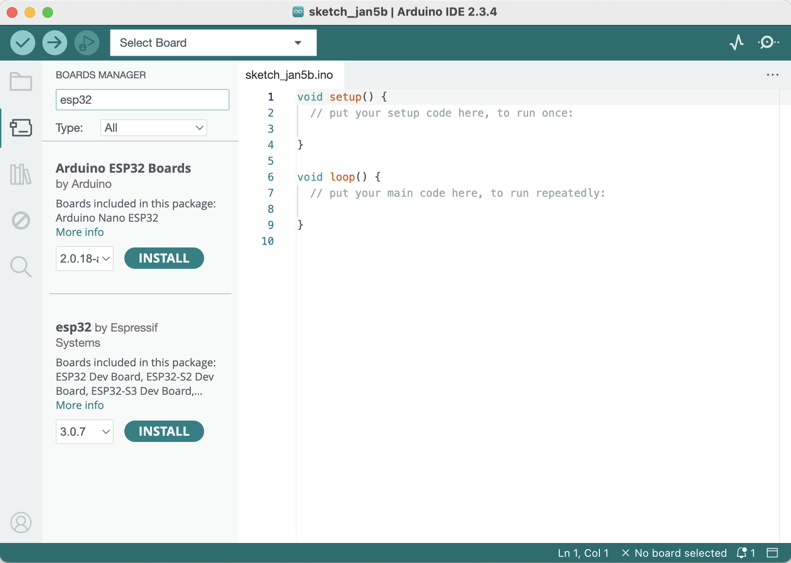
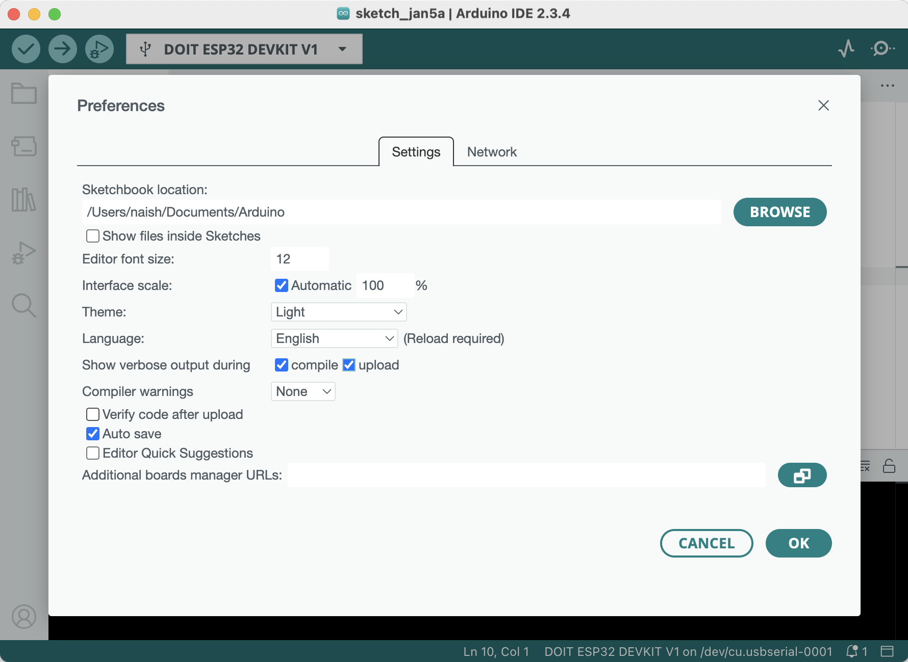

# MSEduino Testing

In order to test the functionality of the MSEduino, test code must be loaded onto the device.

Programs for the [Arduino](https://www.arduino.cc) are called sketches. These are created within an Integrated Development Environment (IDE) for the Arduino. The IDE allows sketches to be written and edited. The language and constructs are similar to C++. It provides functionality to convert (or compile) the human-readable code into instructions that the Arduino hardware understands (machine language). The IDE also facilitates the process of uploading compiled machine code onto the Arduino board. The IDE is available for Windows, Mac OS X and Linux based systems.

To start, visit [Getting Started with Arduino IDE 2](https://docs.arduino.cc/software/ide-v2/tutorials/getting-started-ide-v2/) on the official Arduino website. Follow the [step-by-step instructions](https://docs.arduino.cc/software/ide-v2/tutorials/getting-started/ide-v2-downloading-and-installing/) to download and install the Arduino IDE for the operating system on your laptop or home computer. Once installed, it must be configured for the ESP32 microcontroller. Use a USB-A to USB-micro cable to connect your ESP32 to your computer. Use the **Tools→Board→Boards Manager...** menu to open the boards manager.

Enter "esp32" in the search box. Find the "esp32 by Espressif Systems" boards and click the **Install** button to install the ESP32 boards.

Once the ESP32 boards are installed, use the **Tools→Board→esp32** menu to select the **DOIT ESP32 DEVKIT V1**.

With the board is selected, the Port should be set as **COMx** on Windows or **/dev/cu.usbserial-000x** on Mac. In some cases, you may need to install a driver on your computer so that for the USB to UART bridge on the ESP32 is recognized. If so, it can be downloaded from [Silicon Labs](https://www.silabs.com/developers/usb-to-uart-bridge-vcp-drivers?tab=downloads).

To help identify the cause of hangups and errors during the build and upload processes, it is recommended that verbose output be enabled. Open the Preferences window and ensure that the **compile** and **upload** checkboxes are selected:

## Test Code

The code used to test the MSEduino is hosted in a separate repository on GitHub. It may be found at [https://github.com/MSE2202/MSEduino-R63-Test](https://github.com/MSE2202/MSEduino-R63-Test). You can download (or clone) the entire repository or only the sketch in the **MSEduino-R63-Test folder**.

### Library Installation

In order to compile properly, the test code requires a library to be installed.

#### Adafruit NeoPixel

The Adafruit NeoPixel library is a third-party library that can be installed directly from the Arduino IDE Library Manager. Go to **Tools→Manage Libraries...**. Use the search box to find and install the AdaFruit NeoPixel library.

## Compiling and Uploading Test Code

Once the test code has been downloaded and the required library has been installed, use **File→Open...** to navigate to the folder containing the test code and open the file `MSEduino-V63-Test.ino`. This will open all 3 files in the folder, each in a separate tab. With the MSEduino connected and the board and port set correctly, the program can be compiled and uploaded using **Sketch→Upload**. The board will usually program automatically, but sometimes it is necessary to manually enter programming mode. To program, press and hold the reset button, then press and hold program button, release the reset button, and then release the program button.

## Testing

Once the code is uploaded, reset your MSEduino and open the Serial Monitor (**Tools→Serial Monitor**). Check at the bottom of the window that the speed is set to 115200 baud. The output on your serial monitor should look similar to the figure below.

If necessary, press the **RST** button on the MSEduino, which will reset the device. Follow the instructions to test the functionality of the board. There are 36 tests total. If any tests fail, use the provided instructions to diagnose and correct any issues. If any soldering or other touch ups are required, first disconnect the USB cable and remove the ESP32 to prevent any damage. Connect with a TA if you are unable to resolve the problem.

Note that you can navigate through the tests using `c` to continue to the next test, `b` to return to the beginning of the current test, `s` to skip to the next test, or `q` to quit. You can enter multiple characters if you would like to skip ahead to a particular test. For example, if you would like to skip ahead to Test 10 from Test 1, you can enter a string of 9 `s` characters: `sssssssss`. Similarly, multiple `b`s can also be used. For example, to go from Test 15 to Test 10, you can enter the following string: `bbbbb`.

If you successfully pass Tests 1 through 36, your MSEduino board is built correctly. Congratulations, happy programming!
