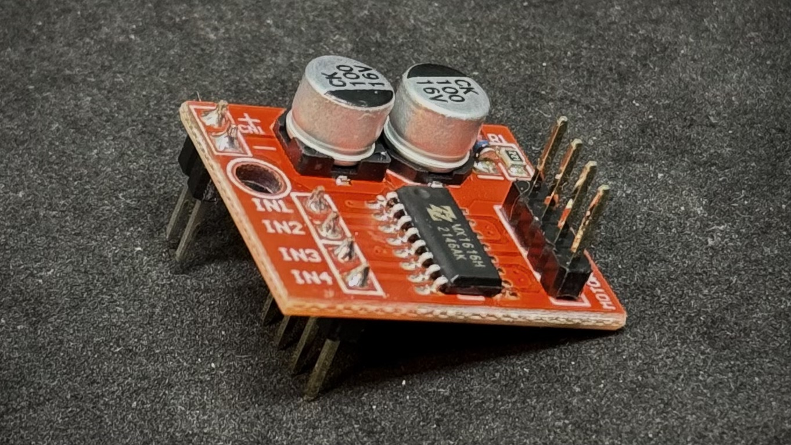

# MX1508 Dual DC Motor Driver Assembly

The MX1508 Dual DC Motor Driver comes without any installed headers. This provides the end user with the opportunity to choose the type of connections that are used. In MSE 2202, the MX1508 is configured with male header pins that connect to female headers on the MSEduino and to female-ended terminal connectors for the driven DC motors.

## Instructions

The complete process of adding headers to the MX1508 DC Motor Driver is demonstrated in the following video.

1. **Begin by putting on a pair of safety glasses.**

2. Solder a 2-pin male header to the power pads (marked + and -) and a 4-pin male header to the control signal pads (marked IN1, IN2, IN3, and IN4). The headers should be soldered to the bottom side of the PCB (facing downwards). Start with one pin of each header, adjust straightness, and check that the pins are aligned with the headers on the MSEduino. If all looks good, solder the other pins.

3. Solder a 4-pin male header to the motor pads (marked MOTOR-A and MOTOR-B). The header should be installed on the top of the PCB (facing upwards). Start with one pin, adjust straightness, and solder the other 3 pins.

5. **Be sure to wash your hands after handling solder.**

## Resources

- [MX1508 Dual DC Motor Driver]([https://components101.com/modules/mx1508-dc-motor-driver-pinout-features-datasheet])
